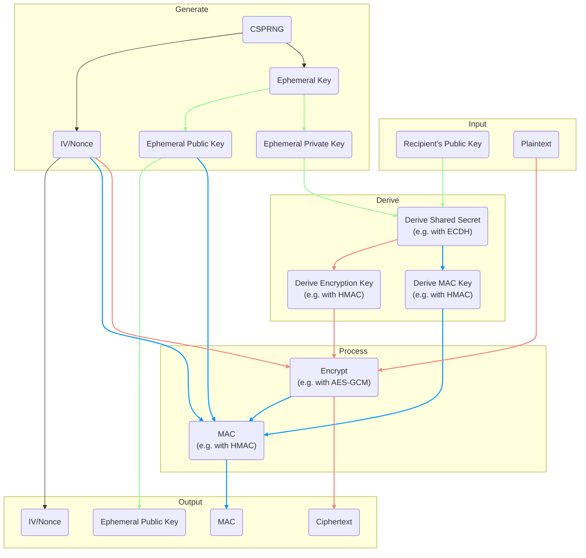
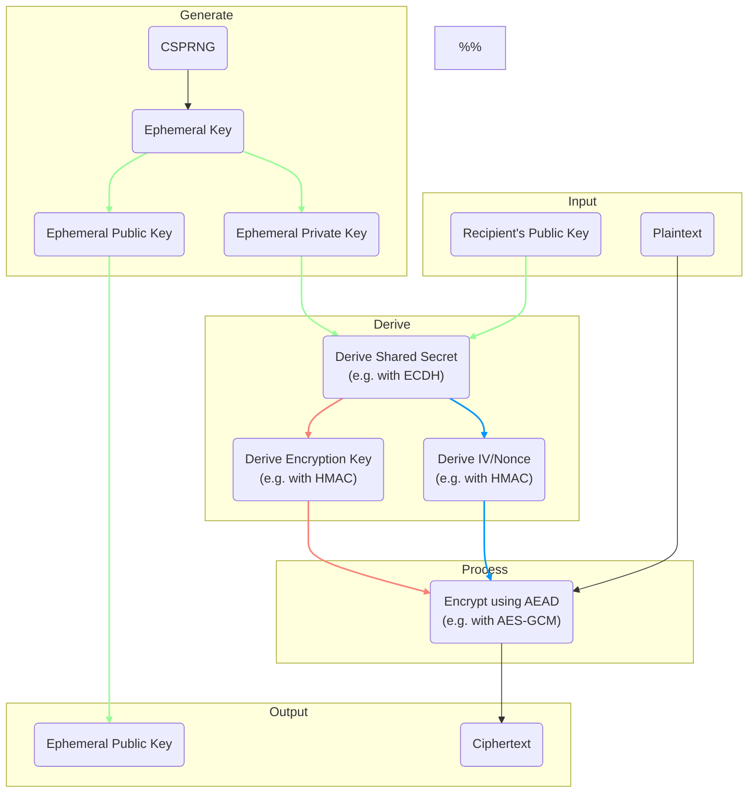

# libes

**lib**rary of **e**ncryption **s**cheme(s) is a collection of ECIES variants.  
The goal of this is library is to become a one-stop shop for everything ECIES.

## Why use libes?
The rust cryptography ecosystem is swarming with crates, with varying degrees
of quality. I have taken it onto myself to navigate this, and I want to share
the results with those who are trying to make sense of it like me.

In doing this I commit myself to:
- Maintain a curated selection of relevant crates
    - Verify that dependencies have not made mistakes in their implementations
    - Use dependencies with good code, performance, and documentation quality
- Provide a uniform and predictable API
    - Use shared constructors in the API to guarantee uniformity
    - Guarantee long-term support for all major releases
- Keep the library up to date & vulnerability-free
    - Automatically update dependencies and test code
    - Prioritize issues & feedback on implementations

# Table of Contents
<!-- TOC -->
* [libes](#libes)
  * [Why use libes?](#why-use-libes)
* [Table of Contents](#table-of-contents)
* [About](#about)
  * [Encryption Scheme Support](#encryption-scheme-support)
    * [Support icon legend](#support-icon-legend)
    * [Elliptic Curve Key Support Matrix](#elliptic-curve-key-support-matrix)
    * [Encryption Support Matrix](#encryption-support-matrix)
  * [What is ECIES?](#what-is-ecies)
  * [How does ECIES work?](#how-does-ecies-work)
  * [Compact mode](#compact-mode)
  * [How does compact mode work?](#how-does-compact-mode-work)
  * [Conditional Compilation](#conditional-compilation)
* [License](#license)
* [Contributing](#contributing)
<!-- TOC -->

# About
## Encryption Scheme Support
### Support icon legend
- 🚀 Completed
- 🏗️ Development
- 📅 Planned
- 🤔 Planning
- 🚫 Can/Will not implement
- ✅ Compact mode compatible
- ❔ Evaluating compact mode compatibility
- ❌ Compact mode not compatible

### Elliptic Curve Key Support Matrix
| Algorithm | Support | Compact |
|:---------:|:-------:|:-------:|
|  x25519   |   🏗️   |    ✅    |
|  ed25519  |   🏗️   |    ✅    |
|   p256    |   🤔    |    ❔    |
|   p384    |   🤔    |    ❔    |
|   p521    |   🤔    |    ❔    |
|   k256    |   🤔    |    ❔    |

### Encryption Support Matrix
|     Algorithm      |           Support           | Compact |
|:------------------:|:---------------------------:|:-------:|
| ChaCha20-Poly1305  | 🚫[^chacha_nonce_collision] | __N/A__ |
| XChaCha20-Poly1305 |             🏗️             |    ✅    |
| AES-GCM-HMAC-SHAX  |             🤔              |    ❔    |

[^chacha_nonce_collision]: ChaCha20 uses a 96-bit nonce,
which when generated using a random function has an unsatisfactory
risk of collision. XChaCha20 uses a 192-bit nonce
where that is not an issue.

## What is ECIES?
ECIES stands for Elliptic Curve Integrated Encryption Scheme.
It is a type of cryptographic procedure which allows encrypting data
for a specific recipient given only the data to be encrypted and
the recipients public key, everything else is derived from the input
or generated with a 
CSPRNG (Cryptographically Secure Pseudo-Random Number Generator).

[Wikipedia](https://en.wikipedia.org/wiki/Integrated_Encryption_Scheme)  
[Crypto++](https://www.cryptopp.com/wiki/Elliptic_Curve_Integrated_Encryption_Scheme)

## How does ECIES work?
The following graph illustrates the behavior of an ECIES implementation with
algorithm types and suggested variants.

Color coding:
- Green: Elliptic Curve Key
- Red: Encryption
- Blue: Message Authentication

## Compact mode
**DISCLAIMER:** Compact mode is my own implementation idea, which I will only
implement for algorithms that I have done extensive research on to ensure
that it is cryptographically secure to do so. Regardless, I am not a cryptography
researcher and I can not give a guarantee that issues will not arise
in the future. If compact mode turns out to be useful/popular and resources allow,
I will make sure compact mode receives a security audit.

Normally ECIES uses an encryption algorithm for the data, and then a MAC
on the resulting ciphertext & other output necessary to decrypt the data.  

By using an AEAD (Authenticated Encryption with Associated Data)
encryption algorithm like AES-GCM or ChaCha20-Poly1305 there is no more
need for an additional MAC, because it is already included in the encryption.  

On top of that the Initialization Vector or nonce can be derived from the
key-agreement operation since the ephemeral private key is randomly generated
which results in the derived IV/nonce still being unique per message.

The now redundant additional MAC and IV/nonce can be omitted,
saving a couple dozen bytes on each message. 

The `Compact` column in the support matrices indicates if the mode is supported.
To use compact mode both the Elliptic Curve Key and Encryption algorithms must
indicate support.

## How does compact mode work?
The following graph illustrates the behavior of a Compact ECIES implementation with
algorithm types and suggested variants.

Color coding:
- Green: Elliptic Curve Key
- Red: Encryption
- Blue: Message Authentication

## Conditional Compilation
All algorithm combinations are gated behind features, to reduce how much is
being compiled. Features are named exactly like the algorithm names in the
support matrices. Methods are then named in order of data flow
(with hyphens dropped, and with the standard ECIES mode omitted in the name),
e.g. `x25519_XChaCha20Poly1305()`
or `x25519_XChaCha20Poly1305_compact()`.

**NOTE:** no ECIES variant are available without activating any features,
at minimum one Elliptic Curve Key feature and one Encryption feature.

**NOTE:** `compact` feature must be explicitly enabled to use compact mode.

# License
Licensed under either of:
- [Apache License, Version 2.0](http://www.apache.org/licenses/LICENSE-2.0)
- [MIT license](http://opensource.org/licenses/MIT)

at your option.

# Contributing
All contributions are very appreciated. If you spot a mistake or a vulnerability in
this crate or any of its dependencies please open an issue. Currently, there is no
template for issues or pull requests, but please try to include enough information
to be able to determine what to do without having to ask too many follow-up questions.

Contributions submitted to this project (be they issues, comments, or pull requests),
as defined in the Apache-2.0 license, will be dual licensed as above,
without any additional terms or conditions.

Contributions with any additional terms than the licenses above, will not be accepted.
